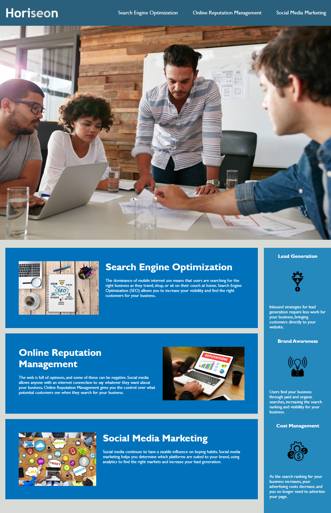

# <module-1-challenge>
# Model-1-Challenge: Refactoring for Accessibility Standards

## Description

This week's challenge was to refactor the starter code provided in order to make it comply with accessibility standards. Now that people with disabilities can access websites using assistive technologies like screen readers, web accessibility has become increasingly important for businesses. In the event that a company's website was not accessible they may face litigation. Web accessibility can help the company avoid these issues as well as boost their visibility in search engines like Google as accessible sites rank higher. In addition to refactoring the code to be accessible, it was also streamlined to organize semantic elements in HTML and consolidate CSS selectors and styling. Lastly, links were updated to function properly. 

---
## Usage

To view the website application please follow the provided link:
https://emmasiren.github.io/module-1-challenge/

The following image shows the web application when loaded correctly: 

